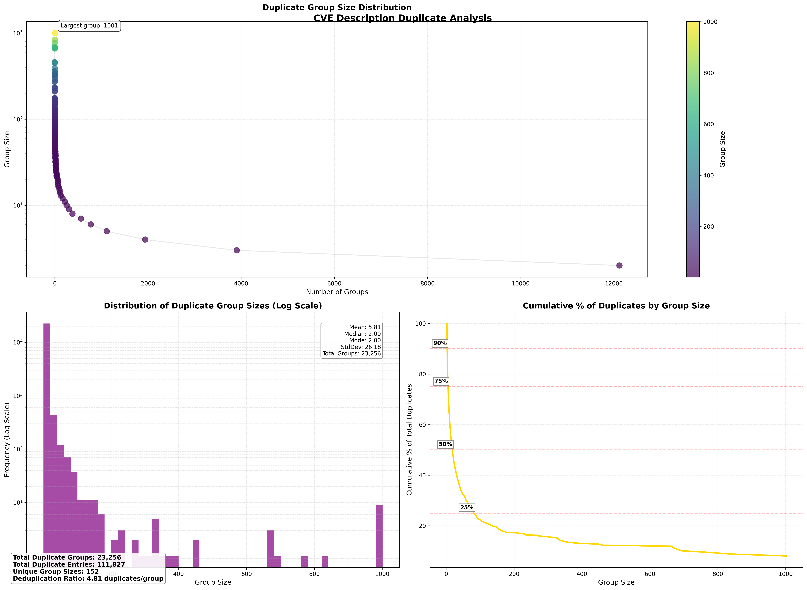
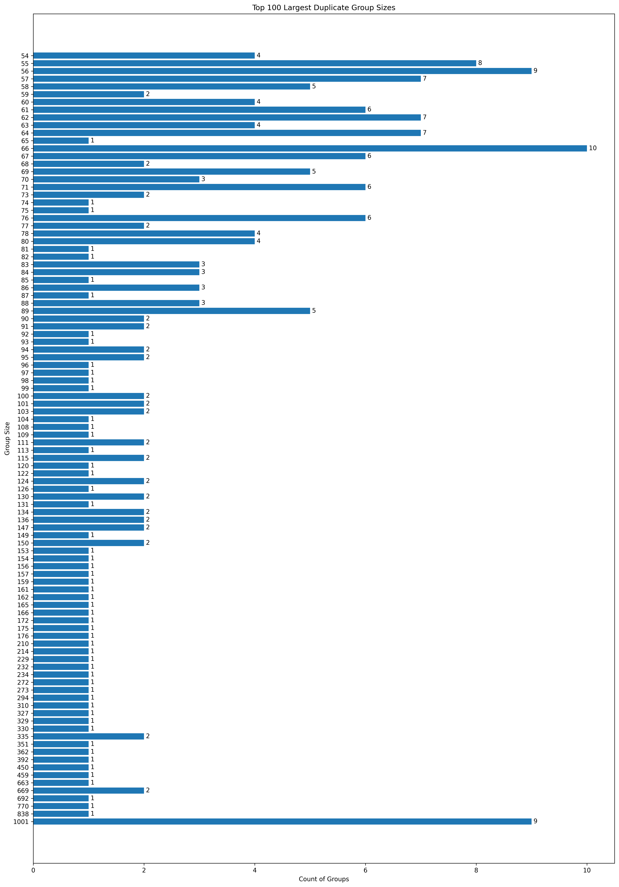

# CVE Deduplication Tool

A Python utility for identifying and removing duplicate CVE (Common Vulnerabilities and Exposures) descriptions using fuzzy string matching.





## Features

- Fuzzy string matching to identify similar descriptions
- Unicode normalization and text cleaning
- Support for compressed CSV files (gzip)
- Detailed duplicate analysis and reporting
- Visualization of duplicate groups
- Configurable similarity threshold and search window

## Requirements

- Python 3.x
- pandas
- rapidfuzz
- tqdm
- matplotlib
- numpy

## Installation

1. Clone the repository
2. Install required packages:
```bash
pip install pandas rapidfuzz tqdm matplotlib
```

## Usage

The tool processes CVE data from a gzipped CSV file and generates several output files:

```bash
python3 cve_dedupe.py
```

### Input

- `./data_in/CVSSData.csv.gz`: Input CSV file containing CVE data with columns:
  - CVE: The CVE identifier
  - Description: The vulnerability description

### Outputs

1. `cleaned_optimized_fuzzy_deduplicated_file.csv.gz`: Deduplicated CVE records
2. `removed_duplicates.csv.gz`: Removed duplicate entries
3. `exact_duplicates.csv.gz`: Exactly matching duplicates
4. `duplicate_info.json.gz`: Detailed analysis of duplicate groups

## Configuration

Key parameters that can be adjusted:

```python
# Fuzzy matching threshold (80% similarity by default)
threshold = 80

# Search window size (1000 entries by default)
window = 1000
```

## Process Flow

1. **Data Loading**: Reads the compressed CSV file
2. **Text Cleaning**:
   - Unicode normalization
   - Lowercase conversion
   - Whitespace normalization
   - Special character handling
3. **Deduplication**:
   - Remove exact duplicates
   - Fuzzy matching for similar descriptions
   - Group identification
4. **Analysis & Reporting**:
   - Generate statistics
   - Create visualizations
   - Save results

## Visualization

The tool generates a horizontal bar chart showing the distribution of duplicate group sizes. This helps in understanding:
- The largest groups of similar descriptions
- The frequency of different group sizes
- The overall effectiveness of the deduplication process

## Performance

The tool uses several optimizations:
- Sliding window approach for comparison
- Early cutoff in fuzzy matching
- Efficient text preprocessing
- Compressed file handling

For a dataset of ~240,000 CVEs:
- Reduction in duplicates: ~34%

## Contributing

Contributions are welcome! Please feel free to submit a Pull Request.

## License

> [!NOTE]  
>This work is licensed under a Creative Commons Attribution-ShareAlike 4.0 International License.
> - https://creativecommons.org/licenses/by-sa/4.0/