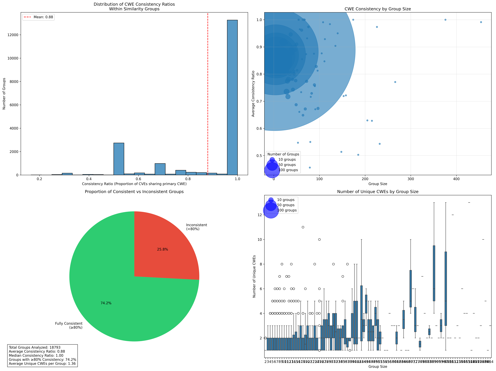
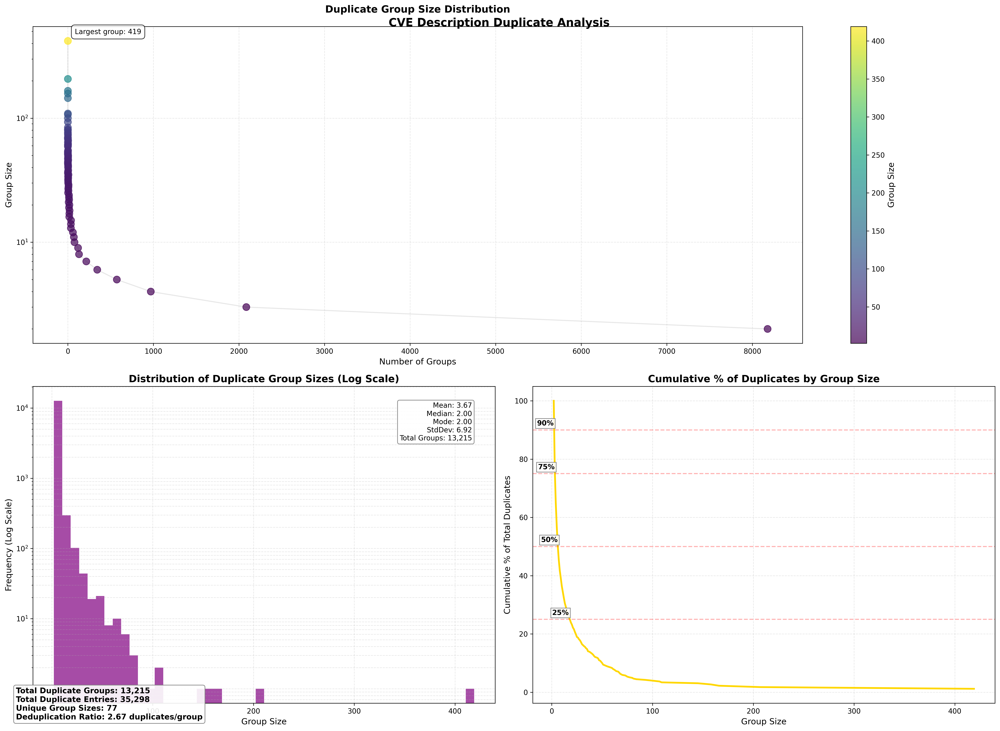
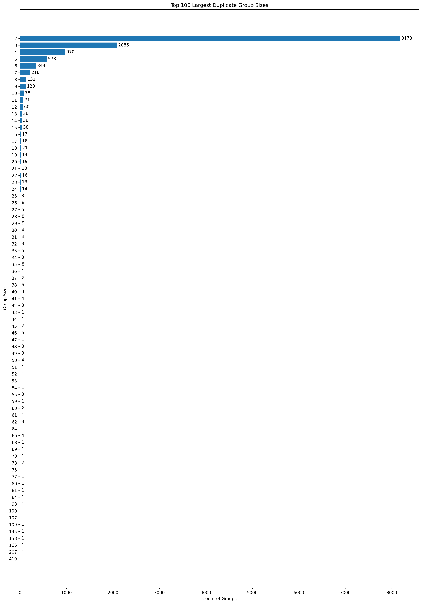

# CVE Description Similarity and CWE Analysis

This project analyzes the relationship between CVE descriptions and their associated CWEs using text similarity analysis. The analysis pipeline processes CVE data to identify groups of similar descriptions and analyzes the consistency of CWE assignments within these groups.

## Table of Contents
- [Data Processing Pipeline](#data-processing-pipeline)
- [Analysis Scripts](#analysis-scripts)
- [Visualizations](#visualizations)
- [Usage Guide](#usage-guide)
- [Results and Insights](#results-and-insights)

## Data Processing Pipeline

### 1. Initial Data Processing

#### json2csv.py
- Processes raw NVD JSONL data
- Extracts CVE IDs, descriptions, and CWEs
- Filters out rejected CVEs
- Output: `CVSSData.csv.gz`

#### Usage
```bash
# Process NVD JSONL data into CVE descriptions and CWEs
python3 scripts/json2csv.py

Processing Summary:
Total entries processed: 275721
Total rejected CVEs: 14595
 - With '** REJECT **': 0
 - With 'Rejected reason:': 14595
CVEs without CWE: 100954
Valid CVEs saved: 261126
Rejection rate: 5.29%
No CWE rate: 38.66%

Top 10 most common CWEs:
CWE
NoCWE      100954
CWE-79      22997
CWE-119     11126
CWE-89       9876
CWE-787      9692
CWE-20       8462
CWE-200      6311
CWE-22       5434
CWE-264      5086
CWE-125      4954
Name: count, dtype: int64

Found 3015 entries with multiple CWEs
Example entries with multiple CWEs:
                CVE              CWE
6320  CVE-2002-2323   CWE-59|CWE-281
6364  CVE-2002-2367  CWE-119|CWE-189
6371  CVE-2002-2374   CWE-59|CWE-362
7818  CVE-2003-1432   CWE-94|CWE-189
7869  CVE-2003-1483  CWE-255|CWE-310

Saved 261126 valid CVE entries to ./data_in/CVSSData.csv.gz

First few entries:
             CVE                                        Description    CWE
0  CVE-1999-0095  The debug command in Sendmail is enabled, allo...  NoCWE
1  CVE-1999-0082      CWD ~root command in ftpd allows root access.  NoCWE
2  CVE-1999-1471  Buffer overflow in passwd in BSD based operati...  NoCWE
3  CVE-1999-1122  Vulnerability in restore in SunOS 4.0.3 and ea...  NoCWE
4  CVE-1999-1467  Vulnerability in rcp on SunOS 4.0.x allows rem...  NoCWE

Total valid CVEs saved: 261126

```
This creates `CVSSData.csv.gz` containing CVE IDs, descriptions, and associated CWEs.


### 2. Analysis Range
Group similar CVE Descriptions by Fuzzy matching thresholds

#### multi_threshold_analysis_range.py
- Analyzes CVE description similarity at different thresholds
- Uses fuzzy string matching
- Generates similarity groups
- Output: Similarity analysis files in `analysis_results/`


#### Usage

```bash
# Run analysis across threshold range
python3 multi_threshold_analysis_range.py


Threshold Comparison:
------------------------------------------------------------------------------------------------------------------------
Threshold  Groups   Duplicates Dup %    Avg Group  Mean Score Med Score  Min Score  Max Score 
------------------------------------------------------------------------------------------------------------------------
95         13285    36375      13.93    2.74       97.58      97.79      66.06      100.00    
90         18793    57282      21.94    3.05       94.13      93.90      64.32      100.00    
85         21771    78777      30.17    3.62       90.15      89.59      52.26      100.00    
80         23158    98882      37.87    4.27       86.28      85.30      52.87      100.00    
75         24076    117128     44.85    4.86       82.46      80.98      43.38      100.00    
70         24727    134380     51.46    5.43       78.72      76.81      43.07      100.00    

Summary Statistics:
--------------------------------------------------
Total CVEs analyzed: 261,126
Total unique CVEs: 224,751
Total duplicate CVEs found: 36,375
Overall duplicate percentage: 13.93%


analysis_results/
    similarity_groups_70.json.gz
    similarity_groups_75.json.gz
    similarity_groups_80.json.gz
    similarity_groups_85.json.gz
    similarity_groups_90.json.gz
    similarity_groups_95.json.gz
    similarity_groups_100.json.gz

```

### 3. Find Similar CVE Descriptions At or Above a Similarity Threshold
#### extract_similar_cves.py
- Processes similarity groups for specific thresholds
- Creates mappings of similar CVEs
- Supports threshold-specific analysis
- Usage: `python3 extract_similar_cves.py --threshold <value>`

````
python3 scripts/extract_similar_cves.py --cve CVE-2015-3765 --threshold 95
Creating similarity mapping for threshold 95...
Saved complete mapping to similar_cves_threshold_95.csv

Similar CVEs for CVE-2015-3765:
['CVE-2015-5753', 'CVE-2015-3792', 'CVE-2015-3789', 'CVE-2015-5751', 'CVE-2015-3791', 'CVE-2015-3788', 'CVE-2015-3779', 'CVE-2015-5779', 'CVE-2015-3790']


python3 scripts/extract_similar_cves.py --cve CVE-2015-3765 --threshold 70
Creating similarity mapping for threshold 70...
Saved complete mapping to similar_cves_threshold_70.csv

Similar CVEs for CVE-2015-3765:
['CVE-2015-5773', 'CVE-2014-1391', 'CVE-2015-3664', 'CVE-2015-3665', 'CVE-2015-3669', 'CVE-2015-5771', 'CVE-2009-0160', 'CVE-2015-7107', 'CVE-2011-0208', 'CVE-2011-0184', 'CVE-2010-3786', 'CVE-2008-2325', 'CVE-2014-1260', 'CVE-2015-5753', 'CVE-2015-3792', 'CVE-2015-3789', 'CVE-2015-5751', 'CVE-2015-3791', 'CVE-2015-3788', 'CVE-2015-3779', 'CVE-2015-5779', 'CVE-2015-3790', 'CVE-2010-3789', 'CVE-2010-3790', 'CVE-2010-3793', 'CVE-2013-1032', 'CVE-2011-0186', 'CVE-2010-0515', 'CVE-2010-0518', 'CVE-2011-3228', 'CVE-2011-0210', 'CVE-2011-3458', 'CVE-2011-3221', 'CVE-2016-1848', 'CVE-2016-4600', 'CVE-2016-4596', 'CVE-2016-4597', 'CVE-2016-4602', 'CVE-2016-1767', 'CVE-2016-1768', 'CVE-2016-4598', 'CVE-2015-3713', 'CVE-2016-4599', 'CVE-2016-1769', 'CVE-2016-4601', 'CVE-2012-3748']


python3 scripts/extract_similar_cves.py --threshold 70 --cve CVE-2021-44228
Creating similarity mapping for threshold 70...
Saved complete mapping to similar_cves_threshold_70.csv

No similar CVEs found for CVE-2021-44228

````


### 4. CVE Similarity by CWE Confidence

#### cwe_predictor.py
This script predicts CWEs for CVEs based on description similarity analysis.

Features:
- Multi-threshold analysis (95% down to 70%)
- Confidence scoring based on CWE frequency
- Supporting evidence with similarity scores
- Detailed analysis at each threshold level

**Understanding Confidence Scores:**  
The confidence score represents how frequently a CWE appears among similar CVEs. For example:
- If 3 out of 10 similar CVEs have CWE-79, the confidence score for CWE-79 would be 30%
- A confidence score of 100% means all similar CVEs share the same CWE
- Higher confidence scores suggest stronger prediction reliability


```bash
# Basic usage
python3 scripts/cwe_predictor.py CVE-2024-1234

# With custom similarity threshold
python3 scripts/cwe_predictor.py CVE-2024-1234 --min-threshold 80

# Save detailed results
python3 scripts/cwe_predictor.py CVE-2024-1234 --output results.json
```

````
python3 scripts/cwe_predictor.py CVE-2024-1234
INFO:__main__:Loading CVE-CWE mapping data...

CWE Prediction Results
==================================================
Target CVE: CVE-2024-1234
Known CWE: NoCWE

Predictions (in order of confidence):

CWE-NoCWE:
  Confidence: 100.0%
  Supporting CVEs: 1
  Evidence:
    - CVE-2024-2750 (similarity: 98.31824062095731%)

CWE-79:
  Confidence: 14.3%
  Supporting CVEs: 3
  Evidence:
    - CVE-2024-0834 (similarity: 95.62913907284768%)
    - CVE-2024-0448 (similarity: 93.12039312039312%)
    - CVE-2024-5757 (similarity: 90.98250336473755%)

CWE-89:
  Confidence: 0.7%
  Supporting CVEs: 1
  Evidence:
    - CVE-2023-5252 (similarity: 90.17980636237897%)
````


````
 python3 scripts/cwe_predictor.py CVE-2015-3765
INFO:__main__:Loading CVE-CWE mapping data...

CWE Prediction Results
==================================================
Target CVE: CVE-2015-3765
Known CWE: 119

Predictions (in order of confidence):

CWE-119:
  Confidence: 100.0%
  Supporting CVEs: 9
  Evidence:
    - CVE-2015-5753 (similarity: 100.0%)
    - CVE-2015-3792 (similarity: 100.0%)
    - CVE-2015-3789 (similarity: 100.0%)

CWE-94:
  Confidence: 6.5%
  Supporting CVEs: 3
  Evidence:
    - CVE-2009-0160 (similarity: 82.70676691729324%)
    - CVE-2011-3228 (similarity: 93.0635838150289%)
    - CVE-2011-3221 (similarity: 81.02893890675242%)

CWE-399:
  Confidence: 2.2%
  Supporting CVEs: 1
  Evidence:
    - CVE-2008-2325 (similarity: 93.0635838150289%)

CWE-264:
  Confidence: 2.2%
  Supporting CVEs: 1
  Evidence:
    - CVE-2011-3458 (similarity: 81.02893890675242%)

CWE-362:
  Confidence: 2.2%
  Supporting CVEs: 1
  Evidence:
    - CVE-2012-3748 (similarity: 80.51948051948052%)
````

### 5. Visualization Generation

#### cwe_similarity_plots.py
- Generates comprehensive visualizations of CWE consistency
- Creates distribution plots, scatter plots, and pie charts
- Output: Various visualization files in `images/`

cve_dedupe_fuzzywuzzy.ipynb


```bash
# Generate various visualization plots
python3 scripts/cwe_similarity_plots_scatter.py
Analysis plots saved to images/cwe_group_consistency.png

python3 scripts/cwe_similarity_plots.py
Analysis plots saved to images/cwe_consistency_analysis.png


```

```bash
python3 scripts/cwe_similarity_analyzer.py 

CVE-CWE Mapping Statistics
==================================================

CWE Consistency Analysis Results
==================================================
Similarity Threshold: 90
Total Groups Analyzed: 16814
Consistent Groups: 13237
Consistency Ratio: 78.73%

Top CWE Co-occurrences in Inconsistent Groups:
--------------------------------------------------
CWE-125 & CWE-787: 231 occurrences
CWE-89 & NVD-CWE-Other: 163 occurrences
CWE-79 & NVD-CWE-Other: 154 occurrences
CWE-20 & NVD-CWE-noinfo: 147 occurrences
NVD-CWE-Other & NVD-CWE-noinfo: 133 occurrences
CWE-119 & CWE-787: 117 occurrences
CWE-200 & NVD-CWE-noinfo: 110 occurrences
CWE-787 & NVD-CWE-noinfo: 103 occurrences
CWE-416 & CWE-787: 81 occurrences
CWE-119 & NVD-CWE-noinfo: 80 occurrences

Group Size Analysis:
--------------------------------------------------
Average Group Size (All): 3.79
Average Group Size (Consistent): 3.20

Example Groups:
--------------------------------------------------

Consistent Group Example:
Base CVE: CVE-2022-30615
Common CWEs: ['CWE-79']
Group Size: 2

Inconsistent Group Example:
Base CVE: CVE-2020-14263
All CWEs: ['CWE-732', 'CWE-327']
Group Size: 2

Detailed results saved to cwe_consistency_analysis_90.json
````

````
python3 scripts/cwe_predictor.py CVE-2024-1234 --debug --summary-output summary.json

{
  "95": [
    {
      "cwe": "['79']",
      "similar_cves_count": 1,
      "count": 1,
      "confidence": 1.0
    }
  ],
  "90": [
    {
      "cwe": "['79']",
      "similar_cves_count": 21,
      "count": 15,
      "confidence": 0.714
    },
    {
      "cwe": "[]",
      "similar_cves_count": 21,
      "count": 6,
      "confidence": 0.286
    }
  ],
  "85": [
    {
      "cwe": "[]",
      "similar_cves_count": 14,
      "count": 7,
      "confidence": 0.5
    },
    {
      "cwe": "['79']",
      "similar_cves_count": 14,
      "count": 7,
      "confidence": 0.5
    }
  ],
  "80": [
    {
      "cwe": "['79']",
      "similar_cves_count": 23,
      "count": 16,
      "confidence": 0.696
    },
    {
      "cwe": "[]",
      "similar_cves_count": 23,
      "count": 7,
      "confidence": 0.304
    }
  ],
  "75": [
    {
      "cwe": "['79']",
      "similar_cves_count": 177,
      "count": 130,
      "confidence": 0.734
    },
    {
      "cwe": "[]",
      "similar_cves_count": 177,
      "count": 47,
      "confidence": 0.266
    }
  ],
  "70": [
    {
      "cwe": "['79']",
      "similar_cves_count": 146,
      "count": 106,
      "confidence": 0.726
    },
    {
      "cwe": "[]",
      "similar_cves_count": 146,
      "count": 39,
      "confidence": 0.267
    },
    {
      "cwe": "['89']",
      "similar_cves_count": 146,
      "count": 1,
      "confidence": 0.007
    }
  ]
}
````


## Visualizations


### Exact and Fuzzy Duplicates (90 Threshold) (`duplicate_comparison.png`)


### CWE Group Consistency Analysis (`cwe_group_consistency.png`)

Visualizes the consistency of CWEs in siimilar groups.

### Duplicate Analysis (`duplicate_analysis.png`)

Visualizes the duplicate detection results across different thresholds.


### CWE Consistency Analysis (`cwe_consistency_analysis.png`)

Shows the distribution of CWE consistency within similarity groups, including:
- Distribution of consistency ratios
- Group size vs consistency relationship
- Proportion of consistent vs inconsistent groups
- Unique CWEs by group size

### Group Distribution (`duplicate_groups_distribution.png`)

Shows the distribution of similarity group sizes.

## Results and Insights

The analysis reveals strong correlation between CVE description similarity and CWE consistency:

1. **High CWE Consistency**
   - 77.8% of similarity groups have consistent CWEs (≥80% same CWE)
   - Mean consistency ratio: 0.90
   - Median consistency ratio: 1.00

2. **Group Size Impact**
   - Smaller groups tend to have higher consistency
   - Even larger groups maintain good consistency (>0.6)
   - Most groups have 2-4 unique CWEs

3. **Practical Implications**
   - Description similarity is a good predictor of CWE relationships
   - Could be useful for:
     - CWE assignment validation
     - Identifying potential misclassifications
     - Automated CWE suggestion systems

## Usage Guide

1. Prepare your data:
   ```bash
   python3 json2csv.py
   ```

2. Run similarity analysis:
   ```bash
   python3 multi_threshold_analysis.py
   ```

3. Extract similar CVEs for specific thresholds:
   ```bash
   python3 extract_similar_cves.py --threshold 90
   ```

4. Generate visualizations:
   ```bash
   python3 cwe_similarity_plots.py
   ```

## Directory Structure
```
.
├── data_in/
│   └── CVSSData.csv.gz
├── analysis_results/
│   └── similarity_groups_*.json.gz
├── images/
│   ├── cwe_consistency_analysis.png
│   ├── duplicate_analysis.png
│   └── cwe_similarity_scatter.png
└── scripts/
    ├── json2csv.py
    ├── multi_threshold_analysis.py
    └── cwe_similarity_plots.py
```


## Contributing

Contributions are welcome! Please feel free to submit a Pull Request.

## License

> [!NOTE]  
>This work is licensed under a Creative Commons Attribution-ShareAlike 4.0 International License.
> - https://creativecommons.org/licenses/by-sa/4.0/
